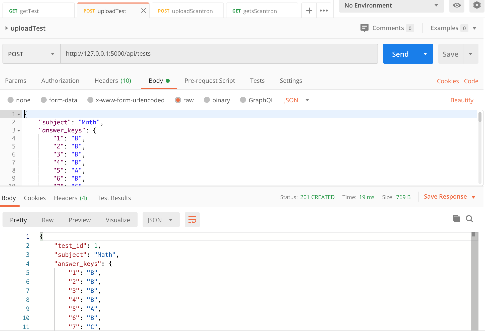
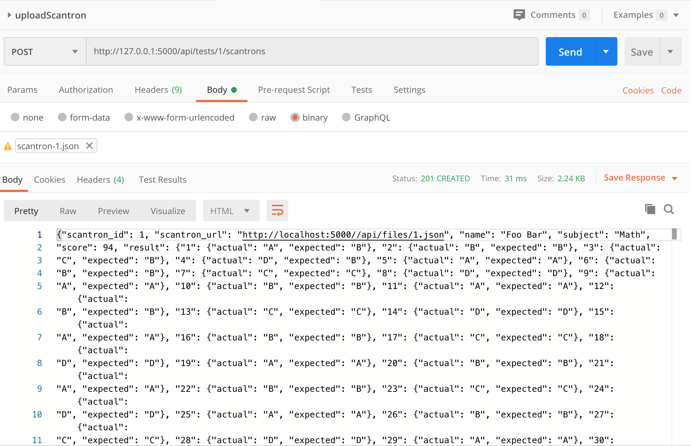
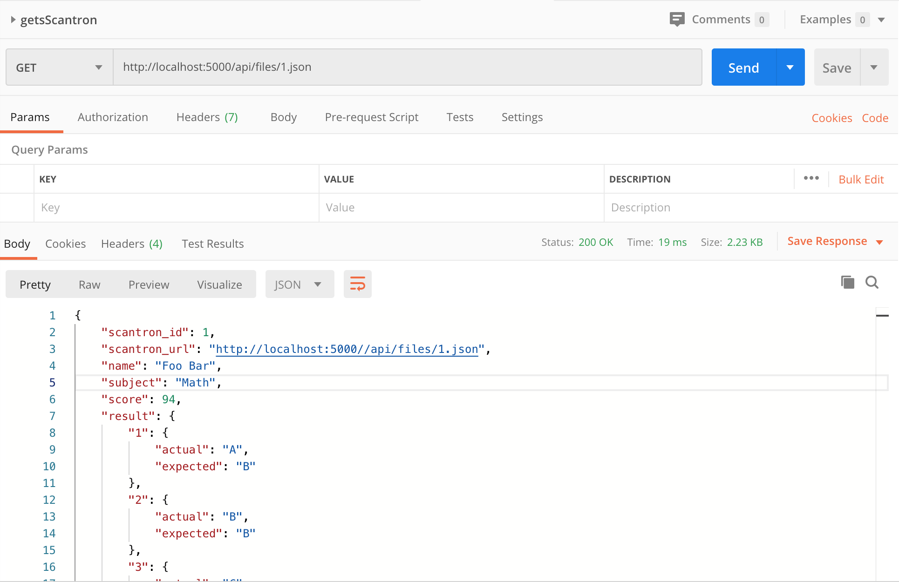
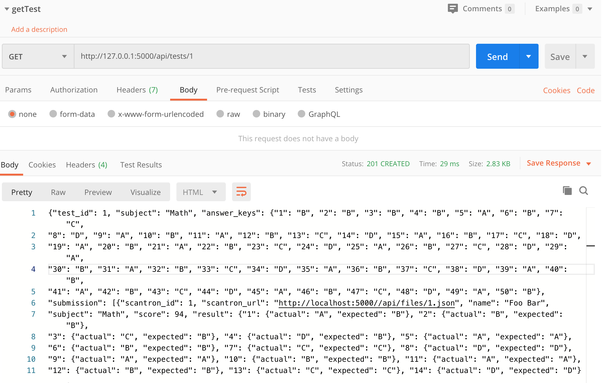
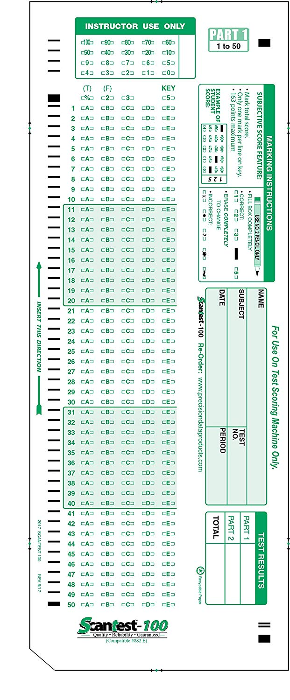

# Assignment 2

In the assignment 2, you will be building a scantron OCR application in Python Flask. The application handles:

* Scantron submission
* Format validation
* Score calculation against answer keys
* Score reporting

All the above features will be handled via a set of REST APIs. The application will persist data into a local SQLite DB.

# How to run

run virtual env
```
source virt/bin/activate
```

run server
```
python app.py
```

# Postman collection
https://github.com/pooldiver69/cmpe273-assignment2/blob/master/assignment2.postman_collection.json

# assginment result

## upload Test



## upload Scantron



## get Scantron



## get test


# APIs

## Create a test

_Request_

> POST http://localhost:5000/api/tests

```json
{
    "subject": "Math",
    "answer_keys": {
        "1": "A",
        "2": "B",
        "3": "C",
        "..": "..",
        "49": "D",
        "50": "E"
    }
}
```

_Response_

```json
201 Created

{
    "test_id": 1,
    "subject": "Math",
    "answer_keys": {
        "1": "A",
        "2": "B",
        "3": "C",
        "..": "..",
        "49": "D",
        "50": "E"
    },
    "submissions": [] 
}
```


## Upload a scantron

_Request_

> POST http://localhost:5000/api/tests/1/scantrons


```http
POST http://127.0.0.1:5000/api/tests/1/scantrons 

"request": {
    "method": "POST",
    "header": [],
    "body": {
        "mode": "file",
        "file": {
            "src": "/Users/FYCAI21/Project/cmpe-273/cmpe273-assignment2/scantron-1.json"
        }
    }
```

_Response_

```json
201 Created

{
    "scantron_id": 1,
    "scantron_url": "http://localhost:5000/files/scantron-1.json",
    "name": "Foo Bar",
    "subject": "Math",
    "score": 40,
    "result": {
        "1": {
            "actual": "A",
            "expected": "B"
        },
        "..": {
            "actual": "..",
            "expected": ".."
        },
        "50": {
            "actual": "E",
            "expected": "E"
        }
    }
}
```

## Get a scantron

_Request_

> GET http://localhost:5000/api/files/1.json

_Response_

```json
{
    "scantron_id": 1,
    "scantron_url": "http://localhost:5000//api/files/1.json",
    "name": "Foo Bar",
    "subject": "Math",
    "score": 94,
    "result": {
        "1": {
            "actual": "A",
            "expected": "B"
        },
        "2": {
            "actual": "B",
            "expected": "B"
        },
        "3": {
            "actual": "C",
            "expected": "B"
        },
        "4": {
            "actual": "D",
            "expected": "B"
        },
        "5": {
            "actual": "A",
            "expected": "A"
        },
        "6": {
            "actual": "B",
            "expected": "B"
        },
        "7": {
            "actual": "C",
            "expected": "C"
        },
        "8": {
            "actual": "D",
            "expected": "D"
        },
        "9": {
            "actual": "A",
            "expected": "A"
        },
        "10": {
            "actual": "B",
            "expected": "B"
        },
        "11": {
            "actual": "A",
            "expected": "A"
        },
        "12": {
            "actual": "B",
            "expected": "B"
        },
        "13": {
            "actual": "C",
            "expected": "C"
        },
        "14": {
            "actual": "D",
            "expected": "D"
        },
        "15": {
            "actual": "A",
            "expected": "A"
        },
        "16": {
            "actual": "B",
            "expected": "B"
        },
        "17": {
            "actual": "C",
            "expected": "C"
        },
        "18": {
            "actual": "D",
            "expected": "D"
        },
        "19": {
            "actual": "A",
            "expected": "A"
        },
        "20": {
            "actual": "B",
            "expected": "B"
        },
        "21": {
            "actual": "A",
            "expected": "A"
        },
        "22": {
            "actual": "B",
            "expected": "B"
        },
        "23": {
            "actual": "C",
            "expected": "C"
        },
        "24": {
            "actual": "D",
            "expected": "D"
        },
        "25": {
            "actual": "A",
            "expected": "A"
        },
        "26": {
            "actual": "B",
            "expected": "B"
        },
        "27": {
            "actual": "C",
            "expected": "C"
        },
        "28": {
            "actual": "D",
            "expected": "D"
        },
        "29": {
            "actual": "A",
            "expected": "A"
        },
        "30": {
            "actual": "B",
            "expected": "B"
        },
        "31": {
            "actual": "A",
            "expected": "A"
        },
        "32": {
            "actual": "B",
            "expected": "B"
        },
        "33": {
            "actual": "C",
            "expected": "C"
        },
        "34": {
            "actual": "D",
            "expected": "D"
        },
        "35": {
            "actual": "A",
            "expected": "A"
        },
        "36": {
            "actual": "B",
            "expected": "B"
        },
        "37": {
            "actual": "C",
            "expected": "C"
        },
        "38": {
            "actual": "D",
            "expected": "D"
        },
        "39": {
            "actual": "A",
            "expected": "A"
        },
        "40": {
            "actual": "B",
            "expected": "B"
        },
        "41": {
            "actual": "A",
            "expected": "A"
        },
        "42": {
            "actual": "B",
            "expected": "B"
        },
        "43": {
            "actual": "C",
            "expected": "C"
        },
        "44": {
            "actual": "D",
            "expected": "D"
        },
        "45": {
            "actual": "A",
            "expected": "A"
        },
        "46": {
            "actual": "B",
            "expected": "B"
        },
        "47": {
            "actual": "C",
            "expected": "C"
        },
        "48": {
            "actual": "D",
            "expected": "D"
        },
        "49": {
            "actual": "A",
            "expected": "A"
        },
        "50": {
            "actual": "B",
            "expected": "B"
        }
    }
}
```

## Check all scantron submissions

_Request_

> GET http://localhost:5000/api/tests/1


_Response_

```json
{
    "test_id": 1,
    "subject": "Math",
    "answer_keys": {
        "1": "A",
        "2": "B",
        "3": "C",
        "..": "..",
        "49": "D",
        "50": "E"
    },
    "submissions": [
        {
            "scantron_id": 1,
            "scantron_url": "http://localhost:5000/files/1.pdf",
            "name": "Foo Bar",
            "subject": "Math",
            "score": 40,
            "result": {
                "1": {
                    "actual": "A",
                    "expected": "B"
                },
                "..": {
                    "actual": "..",
                    "expected": ".."
                },
                "50": {
                    "actual": "E",
                    "expected": "E"
                }
            }
        }
    ] 
}
```





